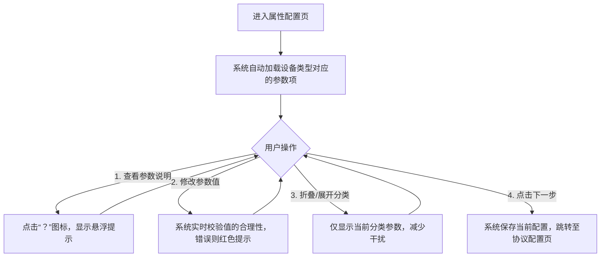

# EMS傻瓜式配置Web原型

# 一、核心设计原则

1. 分步引导：每个流程拆分为线性步骤，顶部进度条清晰提示当前位置；2. 极简操作：每页仅展示1-2个核心任务，避免信息过载；3. 自动填充：所有配置项默认填充物模型/行业标准值，支持微调；4. 可视化交互：拓扑配置、设备选择采用拖拽/卡片式，降低操作难度；5. 即时反馈：配置错误、校验结果实时提示，无需跳转页面；6. 多形式呈现：除文字模拟外，新增分栏对比、交互流程图等直观展示方式。

# 二、物模型创建流程Web原型（5步引导式）

核心逻辑：一次性完成设备全量配置（属性、协议、告警、拓扑元数据），生成可复用模板

## 页面1：物模型创建-基础信息配置（步骤1/5）

```text

┌─────────────────────────────────────────────────────────────┐
│ 【物模型创建】  进度：1/5 基础信息配置                        │
├─────────────────────────────────────────────────────────────┤
│ 设备类型： ▼ （下拉选择，预设：电力调解器/配电柜/电表/负载）   │
│            （选“电力调解器”后，后续页面自动加载算法参数项）    │
│                                                             │
│ 物模型名称：□ （自动提示格式：“10kV电力调解器-XX厂商”）       │
│                                                             │
│ 厂商：     ▼ （下拉选择，预设主流电力设备厂商，支持手动输入） │
│ 型号：     □ （自动填充物模型对应型号，可修改）               │
│                                                             │
│ 描述：     □ （可选，提示：“填写设备适用场景，如XX工厂配电室”） │
├─────────────────────────────────────────────────────────────┤
│ 【上一步】（灰显，不可点击）        【下一步】  【保存草稿】   │
└─────────────────────────────────────────────────────────────┘
关键设计点：
1. 设备类型为核心触发项，决定后续配置项的显示/隐藏；
2. 所有输入框带示例提示，减少思考成本；
3. 物模型ID自动生成（页面底部小字提示：“模型ID将自动生成：EMS_MXXX”）
```

## 页面2：物模型创建-设备属性配置（步骤2/5，以电力调解器为例）

```text

┌─────────────────────────────────────────────────────────────┐
│ 【物模型创建】  进度：2/5 设备属性配置（电力调解器）          │
├───────────────┬─────────────────────────────────────────────┤
│ 左侧配置分类  │ 右侧配置项（带默认值+说明）                  │
│ （可折叠）    │                                             │
│ ├─ 基础属性   │ 额定电压：□10000 V  ？（悬浮提示：设备额定工作电压）│
│ ├─ 算法参数   │ 额定电流：□500 A    ？（悬浮提示：设备额定工作电流）│
│ └─ 扩展属性   │ 额定功率：□5000 kW  ？（悬浮提示：设备额定功率）  │
│               │ ────────────────────────────────────────────│
│               │ 调节阈值：□220 V    ？（悬浮提示：启动调解的电压临界值）│
│               │ 响应时间：□0.5 s     ？（悬浮提示：算法响应延迟）    │
│               │ PID比例系数：□2.5    ？（悬浮提示：算法响应灵敏度）  │
│               │ PID积分系数：□0.1    ？（悬浮提示：消除静态误差）    │
│               │ PID微分系数：□0.05   ？（悬浮提示：抑制超调）        │
│               │ 补偿系数：□1.02      ？（悬浮提示：电压补偿修正系数）│
├───────────────┼─────────────────────────────────────────────┤
│ 【上一步】        【下一步】  【保存草稿】                    │
└───────────────┴─────────────────────────────────────────────┘
关键设计点：
1. 按“基础属性+算法参数”分类，逻辑清晰；
2. 所有参数带行业默认值，用户可直接复用，无需手动输入；
3. 每个参数旁带“？”图标，悬浮显示通俗说明，无需查手册；
4. 扩展属性默认折叠，无需求可不配置。
```

## 页面3：物模型创建-协议&通道模板配置（步骤3/5）

```text

┌─────────────────────────────────────────────────────────────┐
│ 【物模型创建】  进度：3/5 协议&通道模板配置                  │
├───────────────┬─────────────────────────────────────────────┤
│ 配置模块     │ 配置项（自动填充物模型对应默认值）             │
│ ───────────  │                                             │
│ 通信协议配置 │ 协议类型： ▼ （默认：ModbusRTU，可选DL/T645等）│
│              │ 从站地址：□1  ？（悬浮提示：设备通信地址）       │
│              │ 波特率：  ▼ （默认：9600，可选4800/19200）      │
│              │ 数据位：  ▼ （默认：8）                        │
│              │ 校验位：  ▼ （默认：None）                     │
│ ───────────  │                                             │
│ 物理通道模板 │ 通道类型： ▼ （默认：串口，可选网口/4G）        │
│              │ 串口端口：□COM1  ？（悬浮提示：模板默认值，现场可改）│
│              │ 网口IP：  □192.168.1.XXX  （灰显，选网口时激活）│
│              │ 4G卡号：  □ （灰显，选4G时激活）               │
├───────────────┼─────────────────────────────────────────────┤
│ 【上一步】        【下一步】  【测试连接】  【保存草稿】        │
└───────────────┴─────────────────────────────────────────────┘
关键设计点：
1. 协议类型选择后，自动展示对应参数项，隐藏无关配置；
2. 提供“测试连接”按钮（需接入测试设备），实时验证协议参数合法性；
3. 通道参数标注“模板默认值，现场可改”，明确复用逻辑。
```

## 页面4：物模型创建-告警模板配置（步骤4/5）

```text

┌─────────────────────────────────────────────────────────────┐
│ 【物模型创建】  进度：4/5 告警模板配置                        │
├─────────────────────────────────────────────────────────────┤
│ 提示：勾选需要的告警类型，默认阈值已填充，可直接复用或微调   │
│ ────────────────────────────────────────────────────────────│
│ □ 过压告警                阈值：□10500 V  级别：▼警告        │
│    通知方式：□声光 □屏幕弹窗 □邮件 □短信                    │
│ ────────────────────────────────────────────────────────────│
│ □ 欠压告警                阈值：□9500 V   级别：▼警告        │
│    通知方式：□声光 □屏幕弹窗 □邮件 □短信                    │
│ ────────────────────────────────────────────────────────────│
│ □ 算法异常告警            阈值：□0（触发条件） 级别：▼错误    │
│    通知方式：□声光 □屏幕弹窗 □邮件 □短信                    │
│ ────────────────────────────────────────────────────────────│
│ □ 通信中断告警            阈值：□30s（断连时间） 级别：▼错误  │
│    通知方式：□声光 □屏幕弹窗 □邮件 □短信                    │
│ ────────────────────────────────────────────────────────────│
│ □ 自定义告警              名称：□        阈值：□        级别：▼│
│    通知方式：□声光 □屏幕弹窗 □邮件 □短信                    │
├─────────────────────────────────────────────────────────────┤
│ 【上一步】        【下一步】  【保存草稿】                    │
└─────────────────────────────────────────────────────────────┘
关键设计点：
1. 按设备类型预设常用告警类型（如电力调解器默认显示“算法异常告警”）；
2. 告警阈值、级别自动填充，通知方式采用勾选式，操作简单；
3. 支持自定义告警，满足特殊场景需求。
```

## 页面5：物模型创建-拓扑元数据配置（步骤5/5）

```text

┌─────────────────────────────────────────────────────────────┐
│ 【物模型创建】  进度：5/5 拓扑元数据配置（定义可关联设备）      │
├─────────────────────────────────────────────────────────────┤
│ 电压等级： ▼ （默认：10kV，与基础属性一致，可修改）            │
│ ────────────────────────────────────────────────────────────│
│ 可关联上游设备类型：                                          │
│ □ 配电柜    □ 变压器    □ 其他_________                      │
│ ────────────────────────────────────────────────────────────│
│ 可关联下游设备类型：                                          │
│ □ 负载      □ 电表      □ 其他_________                      │
│ ────────────────────────────────────────────────────────────│
│ 提示：后续现场拓扑配置时，将自动校验电压等级和设备类型匹配性  │
├─────────────────────────────────────────────────────────────┤
│ 【上一步】        【完成创建】  【保存草稿】                    │
└─────────────────────────────────────────────────────────────┘
关键设计点：
1. 电压等级自动与基础属性联动，减少重复输入；
2. 上游/下游设备类型采用勾选式，直观易懂；
3. 明确提示拓扑校验规则，让用户清楚配置意义。
```

# 三、现场引导式配置流程Web原型（5步极简微调）

核心逻辑：选择已创建的物模型，仅微调现场差异化参数，全程无专业配置项

## 页面1：现场配置-工程基础信息（步骤1/5）

```text

┌─────────────────────────────────────────────────────────────┐
│ 【EMS现场配置】  进度：1/5 工程基础信息                        │
├─────────────────────────────────────────────────────────────┤
│ 工程名称：□ （提示：如“XX工厂1号配电房EMS配置”）              │
│ 工程位置：□ （提示：如“XX市XX区XX路XX号 配电室”）             │
│ 负责人：  □ （输入姓名）                                      │
│ 联系方式：□ （输入手机号/座机）                                │
├─────────────────────────────────────────────────────────────┤
│ 【上一步】（灰显）        【下一步】                          │
└─────────────────────────────────────────────────────────────┘
关键设计点：仅4个核心输入框，均带示例提示，1分钟即可完成。
```

## 页面2：现场配置-物模型选择/新建（步骤2/5）

```text

┌─────────────────────────────────────────────────────────────┐
│ 【EMS现场配置】  进度：2/5 选择设备物模型                      │
├─────────────────────────────────────────────────────────────┤
│ 选择设备类型： ▼ （下拉：电力调解器/配电柜/电表/负载）         │
│ ────────────────────────────────────────────────────────────│
│ 已创建物模型列表（卡片式，点击选择）：                        │
│ ┌─────────────┐  ┌─────────────┐  ┌─────────────┐          │
│ │ 10kV电力调解器│  │ 低压配电柜  │  │ 智能电表    │          │
│ │ -XX厂商     │  │ -XX厂商     │  │ -XX厂商     │          │
│ │ 电压：10kV  │  │ 电压：380V  │  │ 精度：0.5级 │          │
│ └─────────────┘  └─────────────┘  └─────────────┘          │
│ ────────────────────────────────────────────────────────────│
│ 无匹配模型？ 【快速新建物模型】（点击跳转到物模型创建流程）    │
├─────────────────────────────────────────────────────────────┤
│ 【上一步】        【下一步】（选择后激活）                    │
└─────────────────────────────────────────────────────────────┘
关键设计点：
1. 按设备类型筛选物模型，卡片式展示核心信息（电压、厂商），直观易选；
2. 快速新建入口直达物模型创建流程，无需退出当前引导；
3. 未选择模型时“下一步”不可点击，避免操作失误。
```

## 页面3：现场配置-差异化参数微调（步骤3/5）

```text

┌─────────────────────────────────────────────────────────────┐
│ 【EMS现场配置】  进度：3/5 现场参数微调（仅需修改差异项）      │
├─────────────────────────────────────────────────────────────┤
│ 提示：以下为现场特有参数，其余配置复用物模型默认值（不可修改） │
│ ────────────────────────────────────────────────────────────│
│ 物理通道微调：                                                │
│ 通道类型：串口（不可修改）                                    │
│ 串口端口：▼ （可选：COM1/COM2/COM3/COM4，默认：COM1）          │
│ ────────────────────────────────────────────────────────────│
│ 协议参数微调：                                                │
│ 从站地址：□ （默认：1，可修改范围：1-247）                    │
│ ────────────────────────────────────────────────────────────│
│ 告警阈值微调：                                                │
│ 过压阈值：□10500 V （默认，可修改）                            │
│ 欠压阈值：□9500 V  （默认，可修改）                            │
├─────────────────────────────────────────────────────────────┤
│ 【上一步】        【下一步】  【测试连通性】                    │
└─────────────────────────────────────────────────────────────┘
关键设计点：
1. 仅展示3类现场差异化参数，其余参数灰显（可查看不可修改），减少干扰；
2. 所有可微调项带默认值和范围提示，避免配置错误；
3. “测试连通性”按钮实时验证设备通信是否正常，提前排查问题。
```

## 页面4：现场配置-拓扑关系可视化配置（步骤4/5）

```text

┌─────────────────────────────────────────────────────────────┐
│ 【EMS现场配置】  进度：4/5 拓扑关系配置（拖拽式）              │
├───────────────┬─────────────────────────────────────────────┤
│ 左侧设备列表  │ 右侧拓扑画布（带网格，可视化）                │
│ （已选设备）  │                                             │
│ ┌─────────────┐│ ┌─────────────┐        ┌─────────────┐     │
│ │ 10kV电力调解器││ │ 配电柜      │──┬─────▶│ 电力调解器  │     │
│ └─────────────┘│ └─────────────┘  │     └─────────────┘     │
│ ┌─────────────┐│                  │            │            │
│ │ 配电柜      ││                  │            ▼            │
│ └─────────────┘│                  │     ┌─────────────┐     │
│ ┌─────────────┐│                  │     │ 负载        │     │
│ │ 负载        ││                  │     └─────────────┘     │
│ └─────────────┘│                  │                        │
│                │                  │                        │
│ 操作：         │ 操作：                                       │
│ - 拖拽设备到画布│ - 【连线】（点击后在设备间画箭头，标注连接关系）│
│ - 删除设备     │ - 【删除连线】                                │
│                │ - 【拓扑校验】（点击后提示：“电压等级匹配，拓扑合法”）│
├───────────────┼─────────────────────────────────────────────┤
│ 【上一步】        【下一步】  【保存拓扑】                    │
└───────────────┴─────────────────────────────────────────────┘
关键设计点：
1. 拖拽式操作，无需手动输入设备关系；
2. 连线自动标注连接方向，直观体现电气流向；
3. 拓扑校验按钮实时验证合理性（如10kV设备不可连380V设备），并给出明确提示。
```

## 页面5：现场配置-校验&生效（步骤5/5）

```text

┌─────────────────────────────────────────────────────────────┐
│ 【EMS现场配置】  进度：5/5 配置校验&生效                      │
├─────────────────────────────────────────────────────────────┤
│ 【开始校验】（按钮，点击后执行自动校验）                      │
│ ────────────────────────────────────────────────────────────│
│ 校验结果：（校验后显示）                                      │
│ ✅ 工程信息完整                                              │
│ ✅ 设备通信正常                                              │
│ ✅ 拓扑关系合法                                              │
│ ✅ 所有参数配置有效                                          │
│ ────────────────────────────────────────────────────────────│
│ 配置文件：【导出配置】（JSON格式，用于备份/复用）              │
├─────────────────────────────────────────────────────────────┤
│ 【上一步】        【一键生效】  【配置回滚】（生效后激活）      │
└─────────────────────────────────────────────────────────────┘
关键设计点：
1. 自动校验覆盖所有核心配置项，结果用图标+文字直观展示；
2. 支持导出配置文件，方便备份和批量复用；
3. 提供“配置回滚”按钮，生效异常时可快速恢复，降低风险。
```

# 四、Web原型的多元展示方式（补充）

除文字模拟外，新增以下两种直观展示方式，更清晰呈现页面布局、交互逻辑和元素关系：

## 4.1 方式一：分栏对比展示（布局+说明）

采用左右分栏，左侧标注页面核心区域功能，右侧展示对应原型框架，直观呈现“区域-功能”对应关系。以下以“现场配置-拓扑关系配置页”为例：

左侧：区域功能说明

- 顶部导航区：显示流程名称、当前进度，明确所处环节；

- 左侧设备列表区：展示已选设备，支持拖拽到画布；

- 右侧拓扑画布区：核心操作区，带网格辅助定位，支持连线/删线；

- 底部操作栏：放置上一步/下一步/保存按钮，操作逻辑连贯。

右侧：原型框架示意

```text

┌─────────────────────────────────────┐
│ 【EMS现场配置】 进度：4/5 拓扑关系配置 │
├───────────────┬─────────────────────┤
│ 已选设备列表  │ 拓扑画布（网格背景） │
│ ┌─────────────┐│ ┌─────────────┐    │
│ │ 电力调解器  ││ │ 配电柜      │    │
│ └─────────────┘│ └──────┬────────┘    │
│ ┌─────────────┐│        │             │
│ │ 配电柜      ││        ▼             │
│ └─────────────┘│ ┌─────────────┐    │
│ ┌─────────────┐│ │ 电力调解器  │    │
│ │ 负载        ││ └──────┬────────┘    │
│ └─────────────┘│        │             │
│ 操作：         │        ▼             │
│ - 拖拽设备     │ ┌─────────────┐    │
│ - 删除设备     │ │ 负载        │    │
│                │ └─────────────┘    │
├───────────────┼─────────────────────┤
│ 【上一步】        【下一步】  【保存拓扑】 │
└───────────────┴─────────────────────┘
```

优势：快速建立“区域功能”认知，无需在文字中寻找布局对应关系，适合前期需求确认。

## 4.2 方式二：交互流程图（标注操作逻辑）

用流程图呈现核心页面的操作步骤和交互逻辑，明确“用户操作-系统反馈”的对应关系。以下以“物模型创建-属性配置页”为例：


优势：清晰梳理操作流程和系统反馈机制，避免遗漏关键交互节点，适合开发对接和测试验证。

## 4.3 方式三：关键页面线框图（标注元素位置）

用简单线条标注页面核心元素的位置和尺寸占比，明确“元素-位置”关系。以下以“物模型创建-基础信息页”为例：

```text

页面尺寸：1920*1080（自适应）
┌─────────────────────────────────────────────────────┐  （顶部导航区，高80px）
│ 【物模型创建】  进度：1/5 基础信息配置              │
├─────────────────────────────────────────────────────┤
│                                                     │
│ 设备类型： ▼                                        │  （左对齐，距顶部20px，宽300px）
│                                                     │
│ 物模型名称：□                                        │  （左对齐，距上一元素30px，宽400px）
│                                                     │
│ 厂商：     ▼                                        │  （左对齐，距上一元素30px，宽300px）
│ 型号：     □                                        │  （左对齐，距厂商输入框20px，宽300px）
│                                                     │
│ 描述：     □                                        │  （左对齐，距上一元素30px，宽600px，高80px）
│                                                     │
├─────────────────────────────────────────────────────┤  （底部操作栏，高80px）
│ 【上一步】（灰显）        【下一步】  【保存草稿】   │
└─────────────────────────────────────────────────────┘
```

优势：明确元素尺寸和位置关系，为前端开发提供直观参考，减少沟通成本。

# 五、核心设计亮点总结

- 分步引导无压力：两大流程均拆分为线性步骤，进度条清晰，每步仅聚焦1个核心任务；

- 操作极简少输入：所有配置项默认填充物模型/行业值，现场仅需微调3-5个参数；

- 可视化降低难度：拓扑配置采用拖拽连线，设备选择采用卡片式，无需专业术语理解；

- 实时反馈防出错：配置错误、校验结果即时提示，操作失误可回滚，无风险；

- 多元展示适配广：支持文字模拟、分栏对比、流程图、线框图，适配需求确认、开发对接等不同场景。
> （注：文档部分内容可能由 AI 生成）